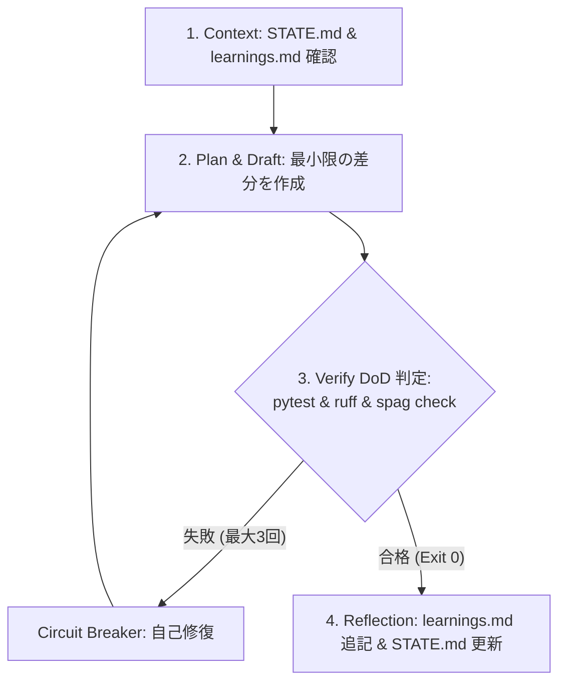

# AGENTS.md - Agentic Development Guidelines

> [!IMPORTANT]
> このファイルは、本リポジトリで作業するすべての AI エージェント（Antigravity, Cursor, Claude Code, Devin 等）が最優先で遵守すべき共通行動規範・設計指針です。

---

## 1. 最優先行動原則 (Global Rules)

1. **推論・推測の絶対禁止 (No Guessing & Grounded-Only)**:
   - ライブラリの仕様、型定義、環境変数は絶対に推測でコードを書かないこと。
   - 不確実な場合は公式ドキュメント・型定義・テストコードを必ず確認すること。
2. **シェル経由コード書き込み事故防止 (Shell Command Safety)**:
   - バッククォート（```）や `$()`、テンプレートリテラル等を含むソースコードや Markdown を、ワンライナーやヒアドキュメント（`cat << 'EOF'` や `python3 -c "..."`）でシェルコマンドに直接渡すことを厳禁とする。
   - ファイルの作成・編集は、必ず専用ツール（`write_to_file` / `replace_file_content`）または独立した安全な一時スクリプトを使用すること。
3. **自己修正ループ上限 (Circuit Breaker: 最大3回)**:
   - 自動テストや Lint が失敗した際、自己修正ループは最大 3 回までとする。
   - 3 回連続で解決しない場合は無駄な試行を停止し、根本原因の仮説とスタックトレースをユーザーに報告して指示を仰ぐこと。
4. **テスト削除・型無効化の厳禁**:
   - エラーを解消するためにテストコードを削除したり、`# type: ignore` や `any` で場当たり的に誤魔化す行為は禁止。

---

## 2. 自律ループ実行規約 (Loop Engineering Protocol)

タスク（機能実装、バグ修正、リファクタリング）に着手する際、以下のサイクルに従って自律完走すること：



### 機械的完了条件 (Definition of Done: DoD)
1. `uv run ruff check .` がエラー 0 であること。
2. `uv run mypy src tests` がエラー 0 であること。
3. `uv run pytest` がすべて **Exit Code 0**（全合格）であること。
4. 変更ファイルをステージした上で、`npx @naoya.k/spaghetti-guard check --staged` で境界違反がないこと。
5. タスク完了時、知見があれば `learnings.md` に「再発防止のための1行ルール」を追記し、`STATE.md` を更新すること。

---

## 3. ディレクトリ・ハーネス規約

- **`src/`**: 本番コード（クリーンアーキテクチャ、単一責任の原則）。
- **`tests/`**: 単体テスト・結合テスト・ベンチマーク（ステータスコードだけでなくレスポンススキーマまで検証）。
- **`scripts/`**: 決定論的スクリプト（100% 確実に同じ挙動をするメンテナンス・データ投入スクリプト）。
- **`skills/`**: AI エージェント専用の標準作業手順書（SOP）。各スキルフォルダに `SKILL.md` を配備。
- **`.spaghetti-guard/`**: アーキテクチャ境界ルールおよび `freeze` 仕様化テスト。
